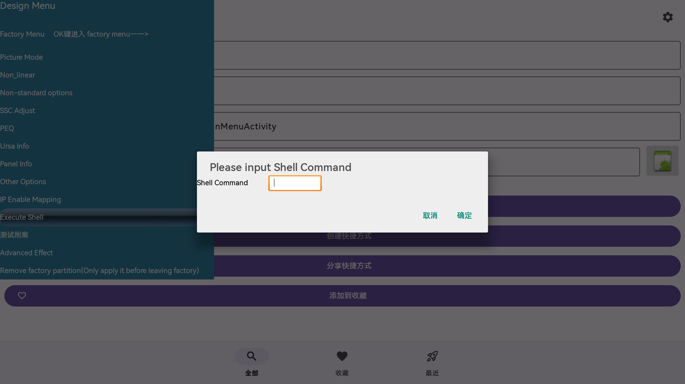

# 极米 Z7X 高亮版开启 ADB 完整教程

> [!IMPORTANT]
> **只想开启 ADB？安装并运行 APK 即可，无需阅读后面的操作步骤。**
>
> 下载 [Z7X ADB 开启器 APK](https://github.com/code-ant/z7x-adb/releases/download/v1.0.0/Z7X-ADB-v1.0.0.apk)，在投影仪上安装后**打开运行一次**，应用会自动开启 ADB。让电脑和投影仪连接同一 Wi-Fi／局域网，再在电脑上执行 `adb connect 投影仪IP:5555` 即可连接（请替换为投影仪的实际 IP）。
>
> **不需要安装 Activity Launcher，也不需要进入 Factory Menu 或手动输入 Shell 命令。** 后续图文步骤仅供想了解实现原理、手动开启过程或排查问题的用户阅读。适用范围以文中已验证的固件为准。

本项目记录在一台极米 Z7X 高亮版投影仪上，从 U 盘安装 Activity Launcher、进入联发科工程菜单、执行 Shell，到开启网络 ADB 的完整过程，并提供一个可独立执行开启操作的 Android APK。

**实测结论：这台设备上，普通第三方 APK 可以设置所需属性并重新启动 adbd，不需要 root、系统签名或辅助功能授权。** 该结论仅适用于本次验证的固件环境，不能推广到所有极米设备。

## 下载 APK

从 [Release 页面](https://github.com/code-ant/z7x-adb/releases/latest)下载 `Z7X-ADB-v1.0.0.apk`，或使用 [APK 直接下载链接](https://github.com/code-ant/z7x-adb/releases/download/v1.0.0/Z7X-ADB-v1.0.0.apk)。将 APK 复制到 U 盘，在投影仪上安装并点一次“打开”，应用就会自动配置 ADB。首次安装但尚未启动时，不会保证自动执行。

如果你只想快速开启 ADB，可以先尝试该 APK；如果想了解或重现发现过程，请从下一节开始。APK 的开启逻辑不依赖预先存在的 ADB 连接。

## 一 设备与准备工作

| 项目 | 本次实测情况 |
| --- | --- |
| 设备 | 极米 Z7X 高亮版，系统 model 为 `XGIMI_TV` |
| Android | Android 9，API 28 |
| Activity Launcher | 2.4.1，包名 `de.szalkowski.activitylauncher` |
| 联发科工程菜单 | `mediatek.factorymenu.ui` |
| 工程菜单入口 | `mediatek.tvsetting.factory.ui.designmenu.DesignMenuActivity` |
| SELinux | `Permissive` |
| 网络 ADB 端口 | TCP 5555 |
| 验证时间 | 2026 年 9 月 25 日 |

准备一只可被投影仪识别的 U 盘、一台电脑，并让电脑与投影仪处于同一局域网。整个方法通过网络连接，不要求把投影仪的 USB-A 接口连接电脑。

工程菜单包含画质、面板及工厂分区等设置。本教程只使用 **Execute Shell**，不要修改其他参数，尤其不要选择 `Remove factory partition`。

## 二 下载并安装 Activity Launcher

1. 在电脑浏览器打开 [Activity Launcher 的 F-Droid 页面](https://f-droid.org/packages/de.szalkowski.activitylauncher/)。
2. 向下找到版本列表，选择稳定版本对应的 **Download APK**。本次实机安装的是 **2.4.1**，不是顶部的开发测试版。页面未来可能更新，安装时检查 Android 版本要求。
3. 把下载得到的 APK 文件复制到 U 盘。若系统隐藏文件扩展名，不要误把网页或下载未完成的文件当成 APK。
4. 将 U 盘插入投影仪，用投影仪的文件管理器打开 U 盘并选择该 APK。
5. 如安装器要求允许此来源安装应用，按投影仪提示为当前安装来源授权，再完成安装。
6. 安装完成后选择“打开”。也可以从投影仪的应用列表打开 **Activity Launcher／活动启动器**。
7. 等待已安装应用和活动列表加载完成。不同版本的 Activity Launcher 界面布局可能略有差别。

Activity Launcher 用于查找、启动系统已经安装的活动；它本身不会替你获得 root 权限，也不会自动开启 ADB。

## 三 找到联发科工程菜单

1. 在 Activity Launcher 中进入“全部”应用列表，使用搜索查找 `MediaTek`、`Factory`，或者直接查找包名 `mediatek.factorymenu.ui`。
2. 展开联发科 Factory 应用。显示名称可能是 **MediaTek Factory** 或类似名称，以包名作为准确识别依据；不要选成 `com.xgimi.minitvfactory`。
3. 在活动列表中找到名称以 **DesignMenuActivity** 结尾的条目。完整类名如下：

   ```text
   mediatek.tvsetting.factory.ui.designmenu.DesignMenuActivity
   ```

4. 打开该活动的详情页，选择“启动活动”或直接启动该条目。实机上显示的窗口标题是 **Design Menu**。
5. 在 Design Menu 左侧菜单中向下移动到 **Execute Shell**，按遥控器确认键进入。它位于 **IP Enable Mapping** 下面，**测试图案** 上面。

注意：应用名称里的 Factory 与 Design Menu 第一项 `Factory Menu` 容易混淆。本次可执行命令的入口位于 **Design Menu → Execute Shell**，不需要先进入第一项 `Factory Menu`。也不应假设名为 `ExecuteShellActivity` 的内部活动可以直接被外部应用启动。

## 四 确认 Shell 输入对话框

打开后应看到标题 **Please input Shell Command**、一个 **Shell Command** 输入框，以及“取消”“确定”按钮。



图 1：用户设备当前页面的原始截图。左侧已选中 Execute Shell；右侧背景为 Activity Launcher。截图未重新绘制，也没有模拟界面。

这个对话框不是完整终端：本次设备可以执行命令，但没有可见的标准输出。因此点击确定后没有显示文字，不等于命令失败；应从电脑测试端口和 ADB 连接。

输入时点击输入框调出键盘，或者使用可用的外接输入设备。命令中的空格和英文标点必须正确；不要输入教程代码块前后的反引号。

## 五 首次手动开启网络 ADB

在 Shell 对话框中**每次输入一条命令**，再选择“确定”。如果确认后对话框关闭，重新选中 Execute Shell，再输入下一条。不要依赖这个单行输入框支持多行粘贴或分号拼接。

第一条，保存网络端口：

```sh
setprop persist.adb.tcp.port 5555
```

第二条，设置当前运行时的网络端口：

```sh
setprop service.adb.tcp.port 5555
```

第三条，启动 ADB 守护进程：

```sh
start adbd
```

原始排查中，这个 Factory Shell 路径成功启动了网络 ADB。若端口已保存、重启后只是服务没运行，用户也确认只输入一次 `start adbd` 即可恢复连接。

如果先前已经有 adbd 在其他端口运行，端口属性写入不会保证现有进程立即重新监听。只有此时才考虑在 Factory Shell 中依次执行 `stop adbd` 和 `start adbd`；停止会中断现有连接。正常首次开启及本项目 APK 均不需要先停止服务。

## 六 从电脑验证连接

1. 在投影仪的网络设置中查看当前局域网 IP。下面以 `192.168.1.100` 为示例，请替换为你自己的 IP。
2. 电脑下载并解压 [Android SDK Platform-Tools](https://developer.android.com/tools/releases/platform-tools)。
3. Windows 在解压后的 `platform-tools` 文件夹中打开 PowerShell。若 `adb` 没有加入 PATH，使用 `.\adb.exe`，如下面的代码块所示。

先检查网络端口：

```powershell
Test-NetConnection 192.168.1.100 -Port 5555
```

看到 `TcpTestSucceeded : True` 后连接：

```powershell
.\adb.exe connect 192.168.1.100:5555
.\adb.exe devices -l
```

成功时会显示 `connected to ...` 或 `already connected to ...`，设备列表中应为 **device**。如果投影仪显示调试授权提示，请在投影仪上核实后确认；本教程和 APK 均不修改 ADB 身份验证策略。

进一步检查：

```powershell
.\adb.exe shell getprop init.svc.adbd
.\adb.exe shell getprop persist.adb.tcp.port
.\adb.exe shell getprop service.adb.tcp.port
.\adb.exe shell getenforce
```

本次实测分别得到 `running`、`5555`、`5555` 和 `Permissive`。端口能连接与 ADB 已完成授权不是一回事，最终以设备列表状态及可执行 shell 为准。

## 七 保存启动配置

最初的 `start adbd` 只是启动服务，并不能独自保证重启后再次启动。后续排查读取了设备上的：

```text
/vendor/etc/init/hw/init.m7642.usb.rc
```

其中与本教程相关的触发关系是：

```text
persist.sys.usb.config=adb
    → sys.usb.config=adb
    → init 启动 adbd
```

在 Factory Shell 中逐条执行以下命令，或者在已经连接成功的电脑上给每条命令前加 `adb shell`：

```sh
setprop persist.sys.usb.config adb
setprop sys.usb.config adb
```

配合前面保存的 `persist.adb.tcp.port=5555`，这就构成本项目采用的持久化配置链路。不要擅自替换成 `mtp,adb`：这台设备的脚本针对该值会改回 `mtp`，并不是本次验证的开启方式。

这里设置的是 USB 配置属性，但作用之一是触发 adbd 启动；TCP 端口属性决定网络监听。设备没有通过 USB 连接电脑，也可以使用网络 ADB。

**验证边界：** 属性写入和 adbd 停止后的恢复已实测；整机重启后的完整启动过程尚未验证，厂商服务仍可能在启动时覆盖配置。不要把“已写入持久化属性”理解为“已经证明每次冷启动都必定成功”。

## 八 使用本项目 APK 自动执行

1. 从本仓库 Release 下载 APK，复制到 U 盘。
2. 使用投影仪文件管理器安装，随后点一次“打开”。
3. 应用自动执行下面的固定命令，不需要先打开 Activity Launcher 或 Factory：

   ```sh
   setprop persist.adb.tcp.port 5555
   setprop service.adb.tcp.port 5555
   setprop persist.sys.usb.config adb
   setprop sys.usb.config adb
   setprop ctl.start adbd
   ```

4. 页面会显示普通应用 UID、各项属性读回值、adbd 状态及本机 5555 端口检测结果。应用提示端口可连接后，再从电脑执行 `adb connect`。
5. “重新开启并检查”按钮可以再次执行；“开机自动尝试恢复 ADB”默认打开。

Factory 中的 `start adbd` 与 APK 中的 `setprop ctl.start adbd` 最终都请求 init 启动服务，但这台设备的 `start` 可执行程序会检查 root UID；普通应用采用后者。APK 不会执行 `stop adbd`，也不会关闭 SELinux 或移除调试认证。

本次 APK 使用普通应用 UID **10039**，没有借用 Factory 的系统 UID。早期讨论曾推测普通 APK 不能写入这些属性，实机测试纠正了这个推测。设备当前 SELinux 为 Permissive 是重要的环境条件，其他固件可能拒绝相同操作。

关闭开机恢复开关只会停止本应用的开机尝试，**不会撤销已经写入的持久化属性**；卸载本应用同样不等于关闭 ADB。

## 九 实机验证记录

| 验证项 | 结果 |
| --- | --- |
| 普通 APK 安装与启动 | 通过 |
| 普通 UID 写入四项属性并读回 | 通过 |
| adbd 运行及本机 TCP 5555 可连接 | 通过 |
| 主动停止 adbd 后，由 APK 自行恢复 | 通过，电脑曾出现 offline／端口拒绝连接，随后恢复 |
| 从电脑执行 ADB shell | 通过 |
| 整机重启后自动恢复 | 未进行重启验证 |
| 其他型号或固件 | 未验证 |

应用的成功输出示例：

```text
ADB 已开启：本机 5555 端口可连接

应用 UID: 10039
persist.adb.tcp.port = 5555
service.adb.tcp.port = 5555
persist.sys.usb.config = adb
sys.usb.config = adb
adbd: running
```

最近一次结果还会保存在投影仪的 `/sdcard/Android/data/local.z7x.adb/files/last-result.txt`。这里的成功检测不等于对远程电脑的网络可达性或调试授权做出保证。

## 十 常见问题

### 搜不到联发科菜单

按包名 `mediatek.factorymenu.ui` 搜索，展开全部活动，查找 `DesignMenuActivity`。若包或活动不存在，该固件可能不含此入口，本教程不能保证适用。

### 直接启动 ExecuteShellActivity 提示权限拒绝

走 **DesignMenuActivity → Execute Shell**。内部 Shell 活动不一定导出给第三方应用；不要把能在包内调用等同于外部可直接启动。

### Shell 确定后没有结果

这是本次设备的实际表现。逐条执行命令，并用电脑检查 5555 端口和设备状态。

### 连接被拒绝或超时

确认 IP 没变、电脑与投影仪处于可互访的同一网络，避免访客网络隔离。拒绝连接通常表示目标端口没有服务；超时也可能来自网络或防火墙。回到 Factory Shell，核对端口设置并执行 `start adbd`，随后再次测试。

### 设备显示 unauthorized 或 offline

`unauthorized` 应检查投影仪上的授权提示。`offline` 可先执行 `adb disconnect IP:5555`，再 `adb connect IP:5555`。不要通过移除认证来解决。

### 重启后又连不上

先启动本项目 APK；或者回到 Factory Shell 执行 `start adbd`。连接恢复后检查上述属性与 `init.svc.adbd`，判断是端口丢失还是服务未启动。

### APK 提示属性写入失败

说明当前固件权限策略可能不同。可以在现有 ADB 连接下读取 `getenforce` 辅助排查。本应用不主动更改 SELinux，不承诺在 Enforcing 固件上可用。

### 如何关闭

先在本应用中关闭“开机自动尝试恢复 ADB”。需要关闭持久化网络调试时，可在 Factory Shell 中逐条设置：

```sh
setprop persist.adb.tcp.port -1
setprop service.adb.tcp.port -1
setprop persist.sys.usb.config none
setprop sys.usb.config none
setprop ctl.stop adbd
```

最后几条可能立即断开当前 ADB 连接，因此优先在设备本地 Factory Shell 执行。这是显式关闭配置，不是恢复出厂原值；不要在不知道原值时声称已经恢复原状。关闭流程未在本次保持连接的实机测试中验证；厂商服务也可能重新改写配置。

网络 ADB 允许同一网络中的其他电脑尝试连接调试，应仅在可信网络开启，用完后按需关闭。

## 十一 Android 工程与构建

工程为原生 Java Android 应用，无第三方运行时依赖。用 Android Studio 打开仓库根目录即可。

```text
app/src/main/
  AndroidManifest.xml
  java/local/z7x/adb/
    MainActivity.java     界面与首次打开自动执行
    AdbController.java    设置属性 启动服务 验证结果
    BootReceiver.java     开机自动尝试
docs/images/              实机教程截图
gradle/wrapper/            Gradle Wrapper
```

构建工具使用 Android Gradle Plugin **7.2.0**、Gradle **7.3.3**、Android SDK Platform **30**、Build Tools **30.0.3**，兼容 JDK 11 或本次使用的 JDK 17。这是沿用已有工具环境的固定组合，不表示最新版本。应用 minSdk 26、targetSdk 28，专用于这台旧版 Android 投影仪环境。

配置 `ANDROID_HOME` 指向你的 Android SDK，或由 Android Studio 生成本地 `local.properties`，然后运行：

```powershell
.\gradlew.bat assembleDebug
```

Linux/macOS：

```sh
./gradlew assembleDebug
```

输出位于 `app/build/outputs/apk/debug/app-debug.apk`。调试包使用开发者自己的调试签名，不能保证覆盖 Release 安装。

发布构建：

```powershell
.\gradlew.bat assembleRelease
```

默认生成未签名 Release APK。若要签名，设置以下环境变量后再构建：`Z7X_KEYSTORE`、`Z7X_STORE_PASSWORD`、`Z7X_KEY_ALIAS`、`Z7X_KEY_PASSWORD`。签名密钥与密码不包含在仓库中。自行生成的签名与本项目 Release 签名不同，不能直接覆盖本项目已安装版本。

应用只声明 `INTERNET` 和 `RECEIVE_BOOT_COMPLETED` 权限。`INTERNET` 用于本机端口检测，不向外部服务器上传数据。

为测试停止后的恢复，MainActivity 支持可选整数参数 `verification_delay_ms`，将启动延迟限制在 0～10000 毫秒内。正常启动不延迟；该参数不执行停止操作。

## 许可与参考

本项目原创源码与教程按 [MIT License](LICENSE) 开源。截图由用户在自有设备上采集，用于说明操作；截图中的第三方界面、名称及商标属于各自权利人。本仓库不包含或重新分发极米／联发科 Factory APK，也不包含 Activity Launcher APK。Gradle Wrapper 由 Gradle 官方工具生成，适用其上游许可。

- [Activity Launcher 下载页面](https://f-droid.org/packages/de.szalkowski.activitylauncher/)
- [Android Platform-Tools](https://developer.android.com/tools/releases/platform-tools)
- [Android ADB 文档](https://developer.android.com/tools/adb)
- [AGP 7.2 官方兼容性说明](https://developer.android.com/build/releases/agp-7-2-0-release-notes)

本项目与极米、联发科、Activity Launcher 无隶属关系。
